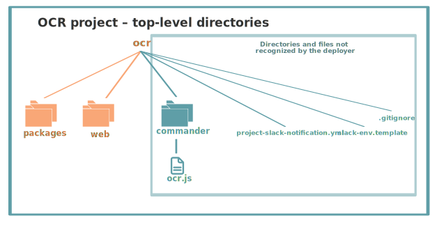

## OCR Tutorial

This tutorial explains the Optical Character Recognition (OCR) demo and shows you how to deploy it to the Nimbella Cloud.

The OCR application displays a web page where visitors select a language (English, Spanish, or Chinese) and then drag a JPG, GIF, or PNG image onto the page, where it is automatically converted to text. If the conversion is successful, users can read the text and click a **Speak** button to hear the text. You can [try out the application here](https://ocrdemo-apigcp.nimbella.io).

The OCR demo is an example of a serverless Nimbella Cloud application with a [React front end](https://reactjs.org) and several functions on the back end. The [Tesseract OCR Engine](https://github.com/tesseract-ocr/tesseract) converts the images to text.

The OCR demo has the following code and configuration components, described in more detail later:

- Application logic: The _packages_ directory contains several Nimbella actions, which are logical collections of functions.
- Static web content: The _web_ directory contains a _public_ directory, with the files that will be part of the public website, and a _src_ directory with React component files and other JavaScript files that are built into the _index.html_ template page to produce the final static public page.
- Slack application: A Nimbella Commander project folder called _commander_, with an _ocr.js_ file with an app that can be installed into Slack.

### Project structure and logic

Nimbella relies on directory and file structure to intelligently deploy projects, so the GitHub project directory structure is organized that way and is described below. For more information about creating and deploying Nimbella Cloud projects, see the [Nimbella Command Line Tool (nim) Guide](https://nimbella.io/downloads/nim/nim.html).

In the following diagrams,  files that contain code or web content are shown with file icons and larger font labels, while project configuration and build files are displayed in smaller fonts without icons.

#### Top-level directories

In any Nimbella project, the deployer looks for one or both of the following top-level directories:

- The _packages_ directory, which contains the back end logic of the project.
- The _web_ directory, which contains static web content published to be published to the front end of the application.

The _packages_ and _web_ directory contents are described in the following sections.

There are also several configuration files. The _project.yml_ file in the OCR demo configures the object store bucket provided with your Nimbella Cloud namespace for web content and database instances.

#### Actions in the packages directory

Actions are discrete units of functional code in languages such as JavaScript, Node.js, or PHP. Actions are usually divided into packages, and the deployer identifies the packages and actions from the directory and file structure.

In this case, the _packages_ directory contains two  packages with six total actions, shown in this diagram and described below:

  - The `ocr` package contains five actions:
    - acceptImage
      Provides a workflow that sequences other actions, invoking the `ocr/imageToText` action at the proper point and invoking the `utils/slack` action to send a notification and the OCR results to Slack (assuming the Commander app is installed into Slack).
    - credential
      This action specifies secure get and put operations between the web page and the storage bucket.
    - imageToText
      Provides logic for the Tesseract conversion of the image to text.
    - progress
      Uses the Redis key-value store provided with your Nimbella namespace to track progress, status, and the OCR text to be displayed.
    - textToSpeech
      Routes the text through Google Translate to be synthesized to speech.
  - The `utils` package, which contains one action:
    - slack
      Logic for Slack notifications for the Commander app.

Packages are used as qualifiers in action names, so the full action names are therefore `ocr/acceptImage`, `ocr/credential`, `utils/slack`, and so on.

##### Build files
Some of the action directories have build files, which trigger an automatic build within the directory in which it's placed any time the code file is modified. In the case of the _acceptImage_ directory, there's a _build.sh_ file, which contains shell commands to run an `npm install` and `npm run build` of that directory. The _package.json_ file specifies the common Node.js dependencies of the code.

### Web content
The Nimbella deployer looks for a directory called _web_ for static web content. The OCR demo contains the  _web_ directory structure shown in the following diagram.

#### Top-level web directory structure

The _web/public_ directory contains the files that will appear in the public website location. The public/index.html_ file is a template for the content that will be generated with React UI components and other JavaScript in the _src_ directory. The _public/manifest.json_ file provides metadata used [when your web app is added to the homescreen on Android](https://developers.google.com/web/fundamentals/web-app-manifest/).

The _build.sh_ file in the _web_ directory runs _npm install_ and _npm run build_ to generate content from the _src_ directory's React components into the _index.html_ file. This happens automatically every time a file is modified.

#### src directory structure

The starting point of the React logic is _index.js_ in the _src_ directory. It imports various React components and CSS, and it imports and renders _App.js_ from the _components_ subdirectory.

_App.js_ contains the sequencing of the other components. It imports _Header_, _FileUpload_, and _Result_. It also adds handlers for various components (language, browsing, camera, file upload) and creates some of the HTML markup. The `Result` code imports the `ImageDisplay` and `TextDisplay` components that control how the image and text are displayed after OCR occurs. If you've tried the demo, it's easy to see what these components refer to.

### Deploy this project to the Nimbella Cloud
If you have the [Nimbella command line tool called `nim`](https://nimbella.io/downloads/nim/nim.html#install-the-nimbella-command-line-tool-nim) installed, you can deploy this project directly from GitHub.  Or, you can clone this repository and deploy from the clone.

- To deploy from GitHub

  `nim project deploy github:nimbella/demo-projects/ocr`

- If you have cloned the repository

   `nim project deploy /path/to/ocr`

The output of this command will include a link to where the application is running in the cloud.
