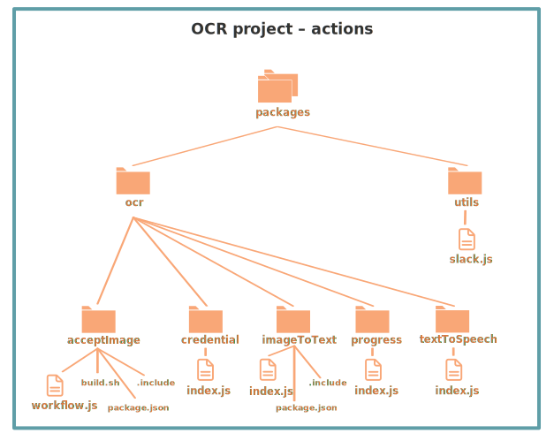
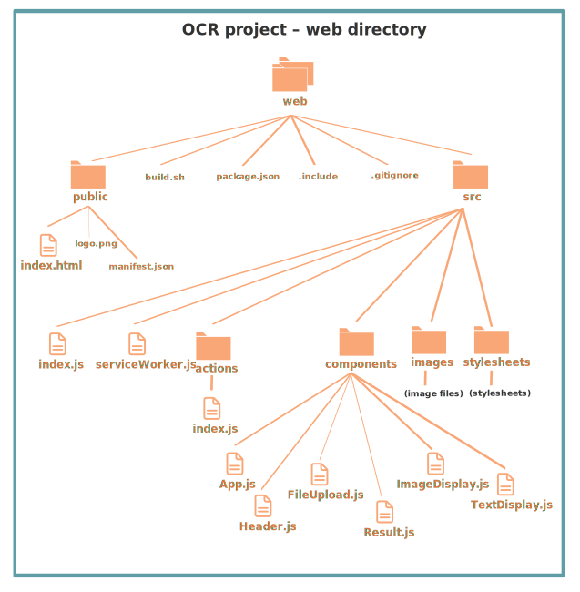

## OCR Tutorial

This tutorial explains the Optical Character Recognition (OCR) demo and shows you how to deploy it to the Nimbella Cloud.

The OCR application displays a web page where visitors select a language (English, Spanish, or Chinese) and then drag a JPG, GIF, or PNG image onto the page, where it is automatically converted to text. If the conversion is successful, users can read the text and click a **Speak** button to hear the text. You can [try out the application here](https://ocrdemo-apigcp.nimbella.io).

This app is an example of a stateful serverless Nimbella Cloud application with a [React front end](https://reactjs.org) and several stateful functions on the back end. The [Tesseract OCR Engine](https://github.com/tesseract-ocr/tesseract) converts the images to text.

The project has the following code and configuration components, described in more detail later:

- Application logic: The [`packages`](./packages) directory contains several functions which implement serverless APIs called actions. A package is a logical collections of functions.
- Static web content: The [`web`](./web) directory contains a [`public`](./web/public) subdirectory, with the files that will be part of the public website, and a [`src`](./web/src) subdirectory with React component files and other JavaScript files that are built into the [`index.html`](./web/public/index.html) template page to produce the final static public page.

The projects makes use of three Nimbella integrated storage services:
1. Web contents are deployed as static assets and served from a Content Delivery Network (CDN).
2. Functions uses object storage to upload and download images provided by the user.
3. Functions record their progress in a key-value store during the image to text analysis so that an API can query the function to determine when the processing is complete.

Nimbella provided serverless web, object, and key store stores for every Nimbella developer. This makes
development of stateful cloud applications easy.

### Project structure and logic

Nimbella relies on directory and file structure to intelligently deploy projects, so the GitHub project directory structure is organized that way and is described below. For more information about creating and deploying Nimbella Cloud projects, see the [Nimbella Command Line Tool (`nim`) Guide](https://nimbella.io/downloads/nim/nim.html).

In the following diagrams, files that contain code or web content are shown with file icons and larger font labels, while project configuration and build files are displayed in smaller fonts without icons.

#### Top-level directories

In any Nimbella project, the `nim` deployer looks for one or both of the following top-level directories:

- The [`packages`](./packages) directory, which contains the back end logic of the project.
- The [`web`](./web) directory, which contains static web content published to be published to the front end of the application.

The packages and web directory contents are described in the following sections.

There are also several configuration files. The [`project.yml`](./project.yml) file for this OCR applications configures the object store bucket provided with your Nimbella Cloud namespace for web content and database instances.

#### Actions in the packages directory

Actions are discrete units of functional code in languages such as JavaScript, Node.js, or PHP. Actions are usually divided into packages, and the deployer identifies the packages and actions from the directory and file structure.

In this case, the [`packages`](./packages) directory contains two packages with six total actions, shown in this diagram and described below:

  - The [`ocr`](./packages/ocr) package contains five actions:
    - **[`acceptImage`](./packages/ocr/acceptImage) -**
      Provides a workflow that sequences other actions, invoking the [`ocr/imageToText`](./packages/ocr/imageToText) action at the proper point and invoking the [`utils/slack`](./packages/utils/slack) action to send a notification and the OCR results to Slack.
    - **[`credential`](./packages/ocr/credential) -**
      This action specifies secure get and put operations between the web page and the Nimbella storage bucket.
    - **[`imageToText`](./packages/ocr/imageToText) -**
      Provides logic for the conversion of the image to text.
    - **[`progress`](./packages/ocr/progress) -**
      Uses the Nimbella key-value store provided with your Nimbella project to track progress, status, and the OCR text to be displayed.
    - **[`textToSpeech`](./packages/ocr/textToSpeech) -**
      Routes the text through Google Translate to be synthesized to speech.

  - The [`utils`](./packages/utils) package, contains one action:
    - **[`slack`](./packages/utils/slack.js) -**
      Logic for sending notifications to Slack so that you can be optionally notified of activity from your application.

Packages are used as qualifiers in action names, so the full action names are therefore `ocr/acceptImage`, `ocr/credential`, `utils/slack`, and so on. The qualified name of the action is also the name of the API it implements.

##### Build files

Some of the action directories have build files, which trigger an automatic build within the directory in which it is placed any time the code file is modified. In the case of the [`acceptImage`](./packages/ocr/acceptImage) directory, there is a [`build.sh`](./packages/ocr/acceptImage/build.sh) file, which contains shell commands to run an `npm install` and `npm run build` of that directory. The [`package.json`](./packages/ocr/acceptImage/package.json) file specifies the Node.js dependencies for this function.

### Web content

The Nimbella deployer looks for a directory called [`web`](./web) for static web content. The OCR demo contains the web directory structure shown in the following diagram. This direction contains the web user interface for the OCR demo. It is implemented using React. The web content of a Nimbella project are uploaded to web storage and served from a CDN.

#### Top-level web directory structure

The [`web/public`](./web/public) directory contains the files that will appear in the public website location. The [`public/index.html`](./web/public/index.html) file is a template for the content that will be generated with React UI components and other JavaScript in the [`src`](./web/src) directory. The [`public/manifest.json`](./web/public/manifest.json) file provides metadata used [when your web app is added to the homescreen on Android](https://developers.google.com/web/fundamentals/web-app-manifest/).

The [`build.sh`](./web/build.sh) file in the web directory runs `npm install` and `npm run build` to generate pre-rendered content from the React components. This happens automatically every time a file is modified.

#### src directory structure

The starting point of the React logic is [`index.js`](./web/src/index.js) in the [`src`](./web/src) directory. It imports various React components and CSS, and it imports and renders [`App.js`](./web/src/components/App.js) from the [`components`](./web/src/components) subdirectory.

[`App.js`](./web/src/components/App.js) contains the sequencing of the other components and provides the functionality for handling file uploads, tracking progress, and rendering results. If you've [tried the demo](https://ocrdemo-apigcp.nimbella.io), it's easy to see what these components refer to.

### Deploy this project to the Nimbella Cloud

If you have the [Nimbella command line tool called `nim`](https://nimbella.io/downloads/nim/nim.html#install-the-nimbella-command-line-tool-nim) installed, you can deploy this project directly from GitHub. Or, you can clone this repository and deploy from the clone.

- To deploy from GitHub

  `nim project deploy github:nimbella/demo-projects/ocr`

- If you have cloned the repository

   `nim project deploy /path/to/ocr`

The output of this command will include a link to where the application is running in the cloud for your account.
