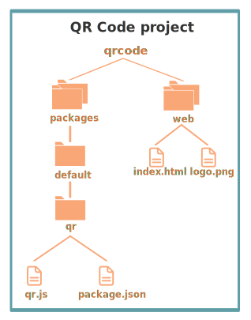

## QR Code Tutorial

This tutorial explains the QR Code demo and shows you how to deploy it to the Nimbella Cloud.

The QR Code demo is a stateless single-page web application that generates a [QR code](https://en.wikipedia.org/wiki/QR_code) from text that a user submits.
The QR Code demo has the following code and configuration components:

- A single index.html file, which has a field for a visitor to enter some text and click **Submit**.
- A single JavaScript file that provides the backend logic for the conversion of text to QR code.
- A Node package manager file called *package.json*, which describes what dependencies the function has.

### Project file structure

The GitHub project has the file structure that Nimbella uses to intelligently deploy the project:

The *packages* directory contains the project's actions, and in this example, there's only one. The first subdirectory name usually serves as the package qualifier, but when it's named *default*, no qualifier is prepended to the action name. The next subdirectory, *qr*, is the name of the action, and the *qr.js* file contains the logic for that action.

The *web* directory contains the  web content for the project. In this case, there is just one HTML file and one image. The _index.html_ file contains a form with a text box for the user to input the text that will be converted.

### Notes on QR logic

The code for the QR action is standard Node.js. It uses an existing Node [library](https://www.npmjs.com/package/qrcode) for the actual code generation.

### Notes on QR web content

The *index.html* file contains the usual markup and logic that you'd write for standard web deployment, with an input form for text. In this case, it calls an API to retrieve a QR code for the form input. This API is implemented by *qr.js*.

### Notes on package.json
The *package.json* file in the *qr* directory triggers an automatic build of the action when the *qr.js* file is modified. For more information about builds, see the [section on incorporating build steps in the Nimbella Command Line Tool document](https://nimbella.io/downloads/nim/nim.html#incorporating-build-steps-for-actions-and-web-content).

### Deploy this project to the Nimbella Cloud
If you have the [Nimbella command line tool called `nim`](https://nimbella.io/downloads/nim/nim.html#install-the-nimbella-command-line-tool-nim) installed, you can deploy this project directly from GitHub.  Or, you can clone this repository and deploy from the clone.

- To deploy from GitHub

  `nim project deploy github:nimbella/demo-projects/qrcode`

- If you have cloned the repository

   `nim project deploy /path/to/qrcode`

The output of this command will include a link to where the application is running in the cloud.
