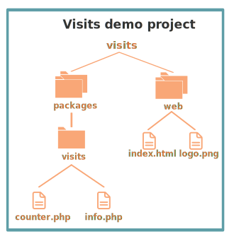

## Page Visits Counter Tutorial

This tutorial describes the Page Visits Counter demo and shows you how to deploy it to the Nimbella Cloud.

This app is stateful and displays on a web page how many times the page has been visited since the project was deployed.

This project has the following components:

- A web front end with a single HTML file.
- Two functions in the back end, implemented in PHP, which create and manage the cookie for the app, and increment the data store of the visit count.

### Project file structure

The GitHub project has the file structure that Nimbella uses to deploy the project with minimal configuration. Here is the directory structure for the Visits project.

#### Actions

Actions are serverless APIs. They run as serverless functions in the Nimbella cloud.

Actions are located under the [`packages`](./packages/visits) directory and determined by the subdirectory structure. In this case, the subdirectory called `visits` serves as a qualifier for the project's two actions. The `visits` directory contains two PHP files, which are determined to be two actions: `visits/counter` and `visits/info`. The qualified name of an action is also the name of the API it implements.

- The code for the `counter` action in [`counter.php`](./packages/visits/counter.php) uses a Nimbella provided key-value store accessible through a [Redis SDK](https://redis.io). Nimbella provides a unique key-value instance for each user account. The `counter` action checks for a cookie first, and if none is found, it increments the count by one and writes to the cookie.

- The `info` action in [`info.php`](./packages/visits/info.php) checks for a file in a Nimbella provided data bucket and returns its contents, which are the date since the project was deployed. If it can't find the file, it creates one and adds the current date.

#### Static web content

The [`web`](./web) directory contains static web content for the project. In this case, there is one HTML file and a logo image.

The [`index.html`](./web/index.html) file contains client-side JavaScript code which makes API calls to the actions and displays the number of visitors and the date that the count started.

### No other configuration or build instructions required

With this directory structure, you don't need any project  configuration or specific build instructions to deploy this project in the Nimbella Cloud. Just run the deployment command in the next section.

### Deploy this project to the Nimbella Cloud

If you have the [Nimbella command line tool called `nim`](https://nimbella.io/downloads/nim/nim.html#install-the-nimbella-command-line-tool-nim) installed, you can deploy this project directly from GitHub. Or, you can clone this repository and deploy from the clone.

- To deploy from GitHub

  `nim project deploy github:nimbella/demo-projects/visits`

- If you have cloned the repository

  `nim project deploy /path/to/visits`

The output of this command will include a link to where the application is running in the cloud for your account.
